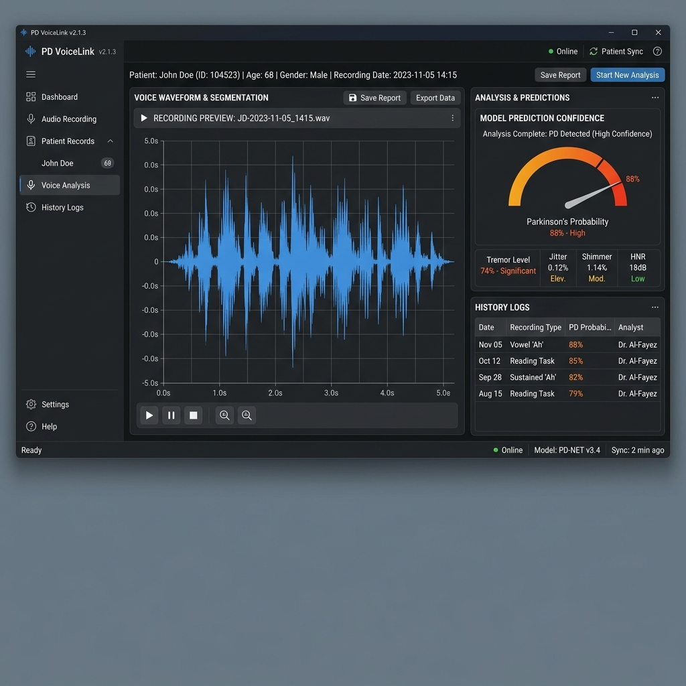
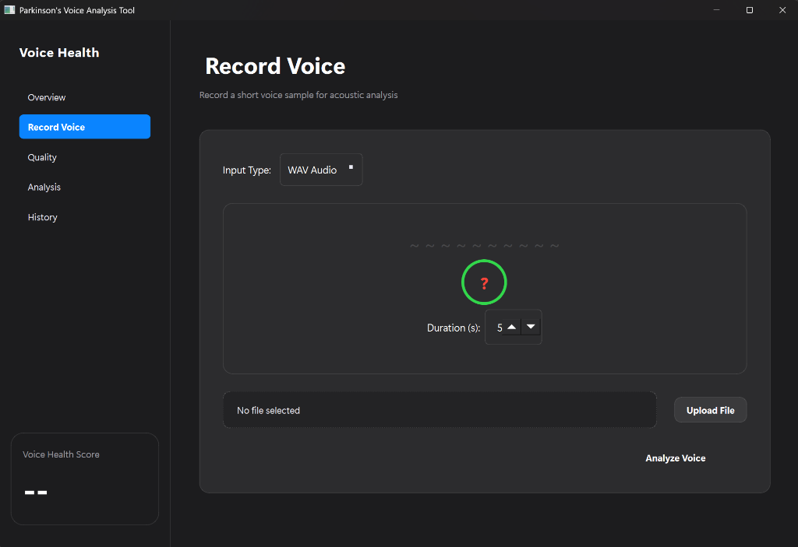

# 🎙️ Voice-Based Parkinson's Detection
### Advanced Acoustic Analysis & Machine Learning Screening

<div align="center">


A state-of-the-art **desktop application** for Parkinson's Disease screening through sophisticated acoustic feature extraction and classical machine learning. Built with PySide6 and librosa, offering a dual-pathway analysis system for both raw audio (WAV) and precomputed numeric features (CSV/XLSX).

> ⚠️ **Disclaimer:** This is a decision-support screening tool — not a medical diagnostic device. Always consult a qualified healthcare professional.

</div>

---

## 📸 Screenshots

| Main Interface | Voice Recording |
|---|---|
|  |  |

---

## ✨ Features

### 🔬 Dual-Pathway Analytical Engine
- **WAV Audio Analysis** — Records or loads audio, then extracts a rich set of acoustic biomarkers using `librosa`
- **CSV / XLSX Ingestion** — Runs inference directly on pre-computed numeric feature datasets

### 🧠 Advanced Feature Extraction
Extracts 50+ features per sample including:
| Category | Features |
|---|---|
| **MFCC** | 13 coefficients × mean + std (26 features) |
| **Pitch (YIN)** | Mean, Std, Min, Max, Median, Range, Voiced Ratio (7 features) |
| **Spectral** | Centroid, Bandwidth, Rolloff, Flatness, RMS × mean + std (10 features) |
| **Spectral Contrast** | 7 bands × mean + std (14 features) |

### ⚙️ Machine Learning Pipeline
- **Pre-trained classifiers** serialized with `joblib` (SVM, Random Forest)
- **Automatic feature scaling** via `StandardScaler` before every inference
- **Confidence scoring** — supports both `predict_proba` and `decision_function` models
- **Graceful fallback** when neither is available

### 🖥️ Enterprise-Grade UI
- **PySide6 framework** — hardware-accelerated, responsive GUI
- **Real-time prediction history** — stored in a local JSON history store
- **Apple-inspired design system** — premium dark-mode interface
- **Live recording** — records directly from microphone via `sounddevice`

### 🤗 Flexible Training
- **Hugging Face Hub integration** — auto-downloads the Italian Parkinson's Voice & Speech dataset (~1.4 GB)
- **Local folder training** — just structure folders as `healthy/` and `parkinson/`
- **CSV training** — train directly on any labelled numeric dataset

---

## 🚀 Quick Start

### 1. Clone the repository
```bash
git clone https://github.com/youssef5520055/app_voice_detection.git
cd app_voice_detection
```

### 2. Create a virtual environment
```bash
python -m venv venv
# Windows
venv\Scripts\activate
# macOS / Linux
source venv/bin/activate
```

### 3. Install dependencies
```bash
pip install -r requirements.txt
```

### 4. Run the app
```bash
python src/main.py
```

---

## 🏋️ Training Your Own Models

### Option A — Hugging Face Dataset (Recommended)
Downloads ~1.4 GB of Italian Parkinson's voice recordings automatically:
```bash
python src/training/train_hf_wav_model.py
```
Output: `src/models/model_audio.joblib` + `src/models/scaler_audio.joblib`

### Option B — Local WAV Folders
Organize your audio files as:
```
data/
├── healthy/
│   ├── sample1.wav
│   └── ...
└── parkinson/
    ├── sample2.wav
    └── ...
```
Then run:
```bash
python src/training/train_wav_model.py --data-dir data/ --out-dir src/models/
```

### Option C — CSV / XLSX Dataset
```bash
python src/training/train_csv_model.py --data dataset.csv --out-dir src/models/
```

---

## 📁 Project Structure

```
app_voice_detection/
├── src/
│   ├── main.py                    # Application entry point
│   ├── components/
│   │   ├── main_window.py         # Main UI window
│   │   └── history_view.py        # Prediction history panel
│   ├── services/
│   │   ├── feature_extraction.py  # MFCC + pitch + spectral extraction
│   │   ├── model_loader.py        # Load joblib artifacts
│   │   └── predictor.py           # Inference engine + confidence scoring
│   ├── training/
│   │   ├── train_csv_model.py     # Train on CSV/XLSX
│   │   ├── train_wav_model.py     # Train on local WAV folders
│   │   └── train_hf_wav_model.py  # Train using HuggingFace dataset
│   ├── assets/styles/styles.py    # Global UI theme
│   ├── data/history.json          # Prediction history store
│   ├── models/                    # Pre-trained model artifacts
│   └── utils/helpers.py           # Shared utilities
├── docs/
│   ├── screenshot.png
│   └── screenshot2.png
├── requirements.txt
└── README.md
```

---

## 📦 Dependencies

| Package | Version | Purpose |
|---|---|---|
| `PySide6` | ≥6.10.2 | Desktop UI framework |
| `librosa` | 0.10.2 | Audio feature extraction |
| `scikit-learn` | 1.5.1 | ML classifiers & scaling |
| `numpy` | ≥1.26.4 | Numerical computing |
| `sounddevice` | 0.4.7 | Microphone recording |
| `soundfile` | 0.12.1 | Audio file I/O |
| `pandas` | 2.2.3 | CSV/XLSX data loading |
| `joblib` | 1.4.2 | Model serialization |
| `huggingface_hub` | 0.24.6 | Dataset downloading |

---

## 🤝 Contributing

Pull requests are welcome. For major changes, please open an issue first to discuss what you'd like to change.

---

## 📄 License

This project is licensed under the MIT License.

---

<div align="center">
Made with ❤️ by <a href="https://github.com/youssef5520055">Youssef Elsayed</a>
</div>
